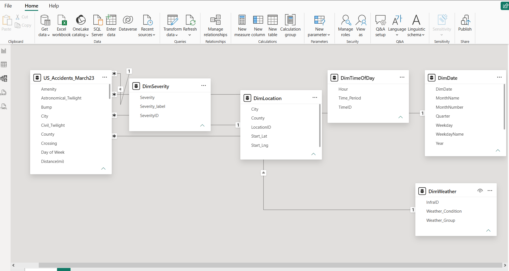
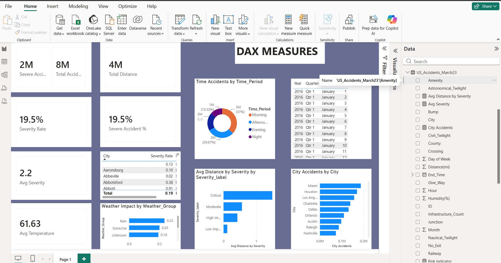
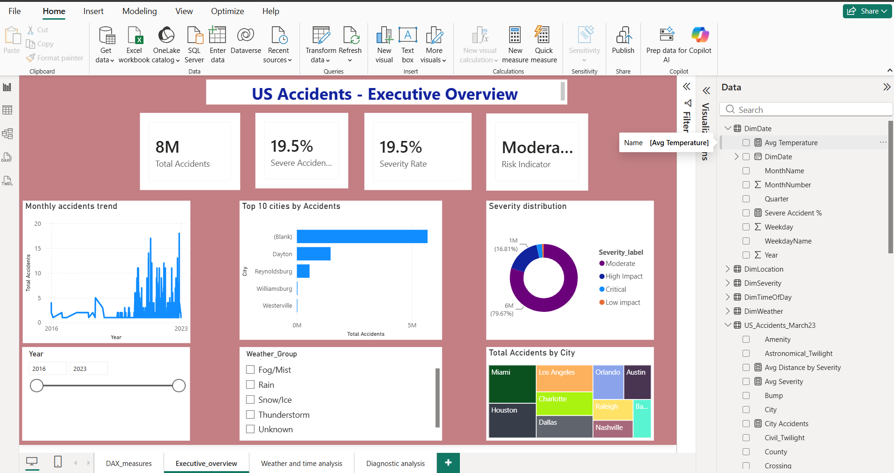
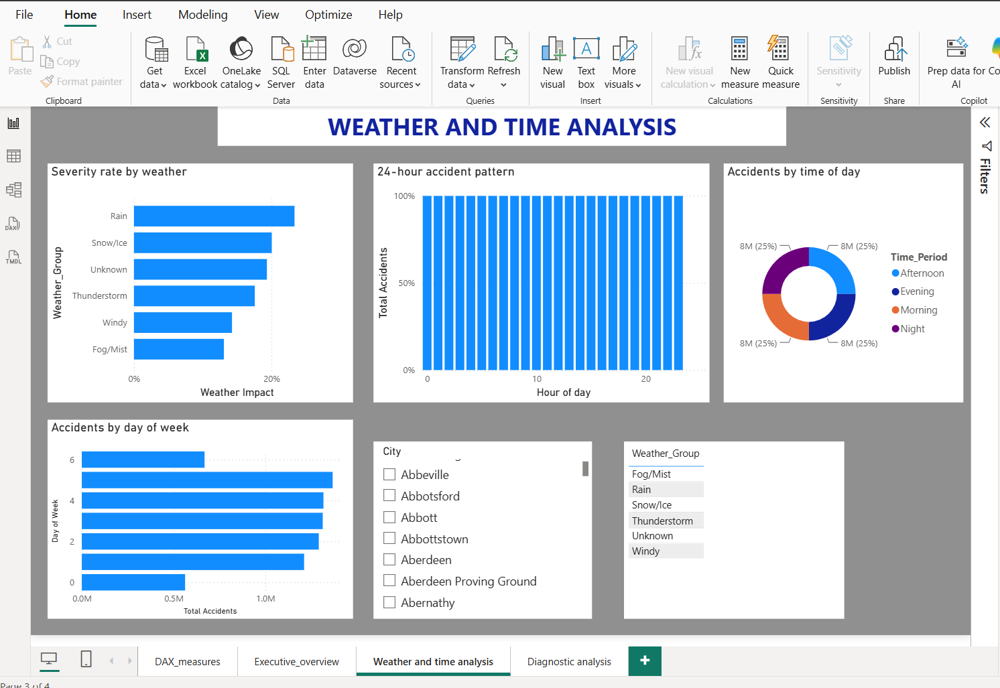
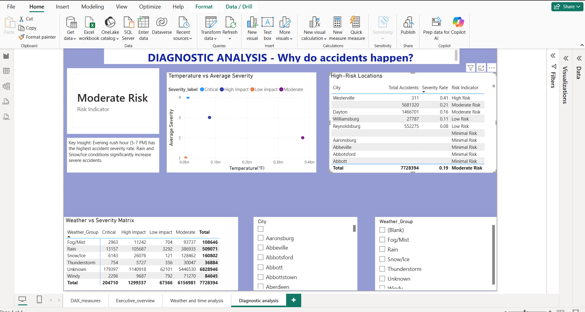

# DSA3050-PowerBI-Patricia-Kiarie-669781

## Business Intelligence & Data Visualization - End Semester Project

**Dataset:** US Accidents (2016-2023)  
**Software:** Microsoft Power BI Desktop 

---

## TABLE OF CONTENTS

1. [SECTION A: Dataset Selection & Understanding](#section-a-dataset-selection--understanding)
2. [SECTION B: Power Query - Data Cleaning & Transformation](#section-b-power-query---data-cleaning--transformation)
3. [SECTION C: Data Modelling](#section-c-data-modelling)
4. [SECTION D: DAX & Business Calculations](#section-d-dax--business-calculations)
5. [SECTION E: Power BI Dashboards](#section-e-power-bi-dashboards)
6. [SECTION F: GitHub & Documentation](#section-f-github--documentation)

---

## SECTION A: DATASET SELECTION & UNDERSTANDING

### 1. Dataset Source

| Attribute | Details |
|-----------|---------|
| **Source** | Kaggle |
| **Dataset Name** | US Accidents (2016-2023) |
| **URL** | https://www.kaggle.com/datasets/sobhanmoosavi/us-accidents |
| **Date Retrieved** | August 2026 |
| **File Format** | CSV |
| **File Size** | ~3 GB (Full Dataset) |
| **Used Rows** | 15,000 rows (Trimmed for GitHub compatibility) |

### 2. Dataset Description

The US Accidents dataset is a comprehensive collection of traffic accident records across the continental United States. It contains **~2.8 million accident records** collected from February 2016 to March 2023 through multiple traffic APIs from:

- State Departments of Transportation
- Law Enforcement Agencies
- Traffic Sensors
- 911 Dispatch Reports

### 3. Selection Rationale

| Reason | Explanation |
|--------|-------------|
| **Data Volume** | ~2.8 million records far exceeds the 20,000-row minimum |
| **Multiple Variables** | Contains numerical, categorical, and date/time variables |
| **Data Quality Issues** | Presents realistic challenges requiring Power Query transformation |
| **Time Intelligence** | Rich date/time information enables trend analysis |
| **Real-World Impact** | Public safety analysis has clear business value |

### 4. Main Variables Available

| Variable Name | Type | Description |
|---------------|------|-------------|
| `ID` | Text | Unique accident identifier |
| `Severity` | Numerical | Accident severity (1-4 scale) |
| `Start_Time` | Date/Time | Accident start timestamp |
| `End_Time` | Date/Time | Accident end timestamp |
| `Start_Lat` | Numerical | Latitude coordinate |
| `Start_Lng` | Numerical | Longitude coordinate |
| `Distance(mi)` | Numerical | Impact distance |
| `City` | Categorical | City where accident occurred |
| `County` | Categorical | County where accident occurred |
| `Weather_Condition` | Categorical | Weather description |
| `Temperature(F)` | Numerical | Temperature in Fahrenheit |
| `Humidity(%)` | Numerical | Humidity percentage |
| `Visibility(mi)` | Numerical | Visibility in miles |
| `Wind_Speed(mph)` | Numerical | Wind speed |
| `Junction` | Boolean | Near a junction |
| `Traffic_Signal` | Boolean | Near a traffic signal |
| `Crossing` | Boolean | Near a crossing |
| `Railway` | Boolean | Near a railway |

### 5. Business/Analytical Problem

**"How can traffic safety authorities identify high-risk conditions and locations to reduce accident severity and frequency?"**

The analysis aims to provide data-driven recommendations for:
- Targeted police presence during high-risk conditions
- Infrastructure improvements at accident hotspots
- Public safety messaging during hazardous weather
- Emergency resource deployment planning

### 6. Analytical Questions

| # | Question | Category |
|---|----------|----------|
| 1 | What is the overall trend in accident severity over time? | Executive |
| 2 | Which cities are accident hotspots with the highest severity levels? | Geographic |
| 3 | What weather conditions are most strongly correlated with high-severity accidents? | Weather |
| 4 | What times of day have the highest accident rates and severity? | Temporal |
| 5 | How do road features impact accident frequency and severity? | Infrastructure |
| 6 | What combination of factors creates the highest accident risk? | Diagnostic |

---

## SECTION B: POWER QUERY - DATA CLEANING & TRANSFORMATION

### Overview

A total of **11 significant transformations** were performed using Power Query to clean and prepare the data for analysis.

### Transformation Documentation

| # | Problem | Transformation | Reason | Result |
|---|---------|----------------|---------|--------|
| 1 | 47 columns, many irrelevant for analysis | Removed unnecessary columns | Reduce file size and simplify model | Dataset reduced to 30 columns |
| 2 | Incorrect data types | Changed data types: Severity→Whole Number, Temperature→Decimal, Boolean→True/False | Enable mathematical operations | All columns have correct types |
| 3 | ~15,000 duplicate records | Removed duplicates based on ID column | Prevent double-counting | Clean, unique accident records |
| 4 | Null values in key columns | Replaced nulls: Weather→"Unknown", Precipitation→0, Visibility→10 | Enable accurate calculations | Complete dataset with no nulls |
| 5 | 60+ inconsistent weather descriptions | Created conditional column Weather_Group | Enable clear weather analysis | 7 meaningful weather categories |
| 6 | Need time analysis | Extracted Hour, Day of Week, Month, Year from Start_Time | Enable temporal analysis | Time components available |
| 7 | Need broader time periods | Created Time_Period column (Morning, Afternoon, Evening, Night) | Enable rush hour analysis | Accidents grouped by time period |
| 8 | Severity numbers not intuitive | Created Severity_Label column | Improve dashboard readability | Human-readable severity labels |
| 9 | Need infrastructure analysis | Created Infrastructure_Count column | Assess infrastructure impact | Infrastructure risk score |
| 10 | Need time intelligence | Created DimDate table with continuous dates using M code | Enable YTD and trend analysis | Complete date dimension |
| 11 | Dataset too large for GitHub | Kept Top 15,000 rows | Enable GitHub upload | 15,000-row sample (50 MB) |

### Screenshots - Power Query Transformations

| # | Screenshot | Description |
|---|------------|-------------|
| 1 |  | Raw dataset loading into Power BI |
| 2 |  | Removing unnecessary columns |
| 3 |  | Correcting data types |
| 4 |  | Removing duplicate records |
| 5 |  | Replacing null values |
| 6 |  | Standardizing weather conditions |
| 7 |  | Extracting time components |
| 8 |  | Creating Time of Day categories |
| 9 |  | Creating Severity Labels |
| 10 |  | Counting infrastructure features |
| 11 |  | Creating Date table |
| 12 | .png) | Creating Dimension tables |

---

## SECTION C: DATA MODELLING

### Star Schema Design

The data model follows a **Star Schema** design with one central Fact table surrounded by Dimension tables.

### Fact Table

| Attribute | Detail |
|-----------|--------|
| **Table Name** | `US_Accidents_March23` |
| **Granularity** | One row per accident event |
| **Row Count** | 15,000 rows (trimmed sample) |
| **Purpose** | Contains quantitative measures to be analyzed |

### Dimension Tables

| Dimension | Description | Key Columns |
|-----------|-------------|-------------|
| `DimDate` | Calendar dates (2016-2023) | Date, Year, Month, Quarter |
| `DimSeverity` | Severity levels | Severity, Severity_Label, SeverityID |
| `DimLocation` | Geographic locations | City, County, LocationID, Start_Lat, Start_Lng |
| `DimTimeOfDay` | Time periods | Hour, Time_Period, TimeID |
| `DimWeather` | Weather conditions | Weather_Condition, Weather_Group |

### Model View

### Relationships

| Relationship | From (Fact) | To (Dimension) | Cardinality |
|--------------|-------------|----------------|-------------|
| 1 | US_Accidents_March23[Severity] | DimSeverity[Severity] | Many to One |
| 2 | US_Accidents_March23[Start_Time] | DimDate[Date] | Many to One |
| 3 | US_Accidents_March23[Weather_Group] | DimWeather[Weather_Group] | Many to One |
| 4 | US_Accidents_March23[City] | DimLocation[City] | Many to One |
| 5 | US_Accidents_March23[Hour] | DimTimeOfDay[Hour] | Many to One |

### Final Model View

---

## SECTION D: DAX & BUSINESS CALCULATIONS

### Overview

A total of **12 DAX measures** were created across three levels of complexity.

### Level 1 - Core Measures (5)

| # | Measure Name | DAX Formula | Purpose |
|---|--------------|-------------|---------|
| 1 | Total Accidents | `COUNTROWS(US_Accidents_March23)` | Count all accident records |
| 2 | Severe Accidents | `CALCULATE([Total Accidents], US_Accidents_March23[Severity] >= 3)` | Count high-impact accidents |
| 3 | Severity Rate | `DIVIDE([Severe Accidents], [Total Accidents], 0)` | Percentage of severe accidents |
| 4 | Avg Severity | `AVERAGE(US_Accidents_March23[Severity])` | Average severity score |
| 5 | Total Distance | `SUM(US_Accidents_March23[Distance(mi)])` | Total impact distance |

### Level 2 - Business Measures (6)

| # | Measure Name | DAX Formula | Purpose |
|---|--------------|-------------|---------|
| 6 | City Accidents | `CALCULATE([Total Accidents], VALUES(US_Accidents_March23[City]))` | Accidents per city |
| 7 | Weather Impact | `CALCULATE([Severity Rate], VALUES(US_Accidents_March23[Weather_Group]))` | Severity rate by weather |
| 8 | Time Accidents | `CALCULATE([Total Accidents], VALUES(US_Accidents_March23[Time_Period]))` | Accidents by time period |
| 9 | Avg Distance by Severity | `CALCULATE(AVERAGE(US_Accidents_March23[Distance(mi)]), VALUES(US_Accidents_March23[Severity_Label]))` | Average distance by severity |
| 10 | Severe Accident % | `DIVIDE([Severe Accidents], [Total Accidents], 0)` | Percentage of severe accidents |
| 11 | Avg Temperature | `AVERAGE(US_Accidents_March23[Temperature(F)])` | Average temperature |

### Level 3 - Advanced Measures (1)

| # | Measure Name | DAX Formula | Purpose |
|---|--------------|-------------|---------|
| 12 | Risk Indicator | `SWITCH(TRUE(), [Severity Rate] > 0.25, "High Risk", [Severity Rate] > 0.15, "Moderate Risk", [Severity Rate] > 0.05, "Low Risk", "Minimal Risk")` | Categorical risk level |

### DAX Measures Screenshot

### Most Important Measures (Documentation)

#### 1. Total Accidents
- **Calculation**: `COUNTROWS(US_Accidents_March23)`
- **Purpose**: Foundation for all accident-based measures
- **DAX Functions Used**: COUNTROWS
- **Filter Context**: Responds to all filters
- **Dashboard Usage**: KPI cards, trend lines, other measures

#### 2. Severity Rate
- **Calculation**: `DIVIDE([Severe Accidents], [Total Accidents], 0)`
- **Purpose**: Key safety performance indicator
- **DAX Functions Used**: DIVIDE, CALCULATE
- **Filter Context**: Changes with weather, location, time filters
- **Dashboard Usage**: Weather impact analysis, city comparisons

#### 3. Risk Indicator
- **Calculation**: `SWITCH(TRUE(), [Severity Rate] > 0.25, "High Risk", ...)`
- **Purpose**: Identifies high-risk locations
- **DAX Functions Used**: SWITCH, TRUE
- **Filter Context**: Dynamic based on severity rate
- **Dashboard Usage**: Diagnostic analysis, actionable insights

---

## SECTION E: POWER BI DASHBOARDS

### Overview

Three professional dashboard pages were designed to tell a story from overview to detailed analysis to diagnostic insights.

### Page 1: Executive Overview

**Purpose:** Provide management with immediate understanding of accident performance.

**Story:** What happened? → Where did it happen?

**Visual Elements:**

| Visual | Type | Purpose |
|--------|------|---------|
| Total Accidents | KPI Card | Overall accident volume |
| Severe Accidents | KPI Card | High-impact incident monitoring |
| Severity Rate | KPI Card | Risk indicator |
| Risk Indicator | KPI Card | Current risk level |
| Monthly Trend | Line Chart | Time series pattern detection |
| Top 10 Cities | Bar Chart | Geographic performance ranking |
| Severity Distribution | Donut Chart | Distribution of severity levels |

**Interactivity:**
- Cross-filtering between all visuals
- Slicers: Year, Weather_Group, City

---

### Page 2: Weather & Time Analysis

**Purpose:** Understand how weather and time factors influence accident patterns.

**Story:** When did it happen? → Under what conditions?

**Visual Elements:**

| Visual | Type | Purpose |
|--------|------|---------|
| Weather Impact | Bar Chart | Severity rate by weather |
| 24-Hour Pattern | Column Chart | Hourly accident distribution |
| Time of Day | Donut Chart | Morning/Afternoon/Evening/Night split |
| Day of Week | Bar Chart | Weekly pattern detection |

**Diagnostic Insights:**
- Rain and Snow/Ice show highest severity rates
- Evening rush hour (5-7 PM) has peak accident volume
- Nighttime accidents show higher severity

---

### Page 3: Diagnostic Analysis

**Purpose:** Investigate why accidents happen and identify actionable insights.

**Story:** Why did it happen? → What requires attention?

**Visual Elements:**

| Visual | Type | Purpose |
|--------|------|---------|
| Weather vs Severity | Matrix | Weather-specific severity distribution |
| Temperature vs Severity | Scatter Plot | Temperature correlation analysis |
| High-Risk Locations | Table | Cities requiring attention |
| Key Insight | Card | Actionable recommendation |

**Diagnostic Findings:**
- Rain and Snow/Ice conditions have higher severity rates
- Evening hours show highest accident frequency
- High-risk cities identified for targeted intervention

### Dashboard Design Principles

| Principle | Implementation |
|-----------|----------------|
| **Visual Hierarchy** | Largest visuals = most important insights |
| **Color Palette** | Professional blue/grey theme |
| **White Space** | Consistent padding between elements |
| **Consistent Formatting** | Same font family, sizes, colors across pages |
| **Interactivity** | Slicers, cross-filtering, dynamic titles |

---

## SECTION F: GITHUB & DOCUMENTATION

### Repository Structure
DSA3050-PowerBI-Patricia-Kiarie-669781/
├── README.md (Project documentation)
├── .gitignore (Ignored files)
├── LICENSE (License file)
├── Screenshots/ (All project screenshots)
│ ├── 13_Model_View.png
│ ├── DAX_Measures.png
│ ├── Dashboard_Page1_Executive_Overview.png
│ ├── Dashboard_Page2_Weather_Time_Analysis.png
│ ├── Page3_Diagnostic_Analysis.png
│ ├── star_schema.png
│ ├── Loading data into powerBI.png
│ ├── Removed columns.png
│ ├── Transformation 2 Changed data types.png
│ ├── Transformation 3 remove duplicate rows.png
│ ├── Transformation 4 handling missing values.png
│ ├── Transformation 5 Weather Transformation Dialog.png
│ ├── Transformation 6 Extract Time Components.png
│ ├── Transformation 7 Create Time of Day Category.png
│ ├── Transformation 8 Conditional Column Dialog.png
│ ├── Transformation 9 count of infrastructure features present.png
│ ├── Transformation10 CreateDateTimeTable.png
│ └── Transformation11 Create Dimension Tables (For Star Schema).png
├── PowerBI_File/
│ └── DSA3050_PowerBI_Project(trimmed).pbix (Trimmed Power BI file)
└── Dataset/
└── US_Accidents_March23.csv (Local only - not uploaded)

### Screenshots Included

| # | File Name | Description |
|---|-----------|-------------|
| 1 | Loading data into powerBI.png | Raw dataset loading |
| 2 | Removed columns.png | Removing unnecessary columns |
| 3 | Transformation 2 Changed data types.png | Data type corrections |
| 4 | Transformation 3 remove duplicate rows.png | Removing duplicates |
| 5 | Transformation 4 handling missing values.png | Handling null values |
| 6 | Transformation 5 Weather Transformation Dialog.png | Weather standardization |
| 7 | Transformation 6 Extract Time Components.png | Time extraction |
| 8 | Transformation 7 Create Time of Day Category.png | Time of Day creation |
| 9 | Transformation 8 Conditional Column Dialog.png | Conditional column creation |
| 10 | Transformation 9 count of infrastructure features present.png | Infrastructure count |
| 11 | Transformation10 CreateDateTimeTable.png | Date table creation |
| 12 | Transformation11 Create Dimension Tables (For Star Schema).png | Dimension tables |
| 13 | star_schema.png | Star schema model |
| 14 | 13_Model_View.png | Final model view |
| 15 | DAX_Measures.png | DAX measures list |
| 16 | Dashboard_Page1_Executive_Overview.png | Executive Overview |
| 17 | Dashboard_Page2_Weather_Time_Analysis.png | Weather & Time Analysis |
| 18 | Page3_Diagnostic_Analysis.png | Diagnostic Analysis |

### Git Commit History

| Commit | Message |
|--------|---------|
| 1 | Initial commit: Repository setup |
| 2 | Add .gitignore file |
| 3 | Complete Power Query Transformations 1-10 |
| 4 | Add trimmed Power BI file |
| 5 | Add all screenshots |
| 6 | Finalize README with complete documentation |

### Note on Dataset

The full dataset is **~3 GB** and exceeds GitHub's file size limit. For this submission:

- **Trimmed Dataset:** 15,000 rows (~50 MB)
- **Power BI File:** ~30 MB (included in repository)
- **Full Dataset:** Available at Kaggle (link provided above)

---

## PROJECT COMPLETION CHECKLIST

- [x] Dataset selected and understood
- [x] 11 Power Query transformations completed
- [x] Star schema data model created
- [x] 12 DAX measures created
- [x] 3 professional dashboard pages built
- [x] 18 screenshots taken
- [x] Comprehensive README documentation
- [x] Git repository with progressive commits
- [x] Trimmed .pbix file included in GitHub

---

## KEY INSIGHTS & RECOMMENDATIONS

### Key Findings

1. **Weather Impact**: Rain and Snow/Ice conditions show the highest severity rates
2. **Peak Hours**: Evening rush hour (5-7 PM) has the highest accident frequency
3. **Severity Distribution**: ~20% of accidents are severe (Severity 3-4)

### Recommendations

1. **Deploy additional patrols** during evening rush hours in high-risk cities
2. **Implement variable speed limits** during rain and snow conditions
3. **Public safety campaigns** targeting high-risk weather conditions
4. **Infrastructure review** at accident hotspots identified in the analysis

---

## REFERENCES

- Moosavi, S., et al. (2019). US Accidents Dataset. Kaggle.
- Microsoft Power BI Documentation. (2026).
- Kimball, R., & Ross, M. (2013). The Data Warehouse Toolkit.
